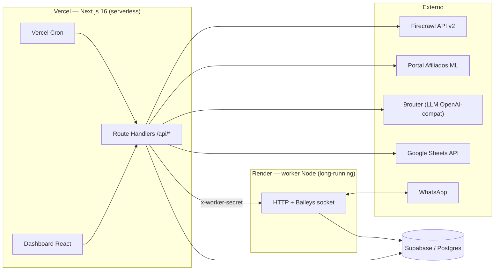
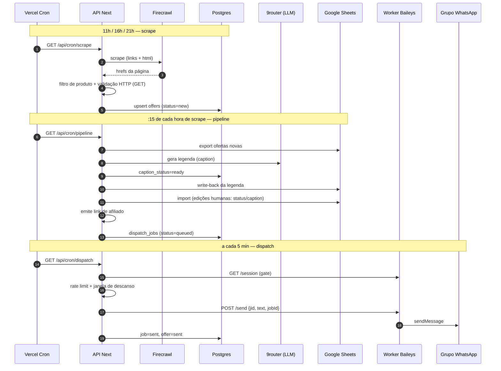
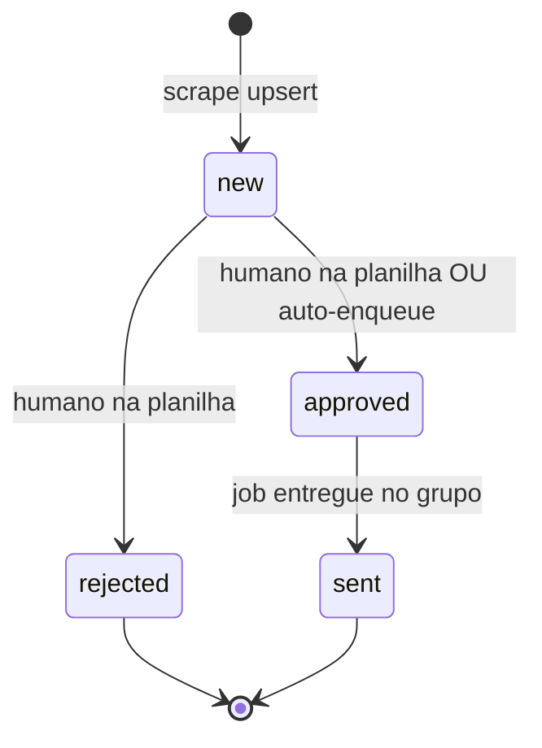
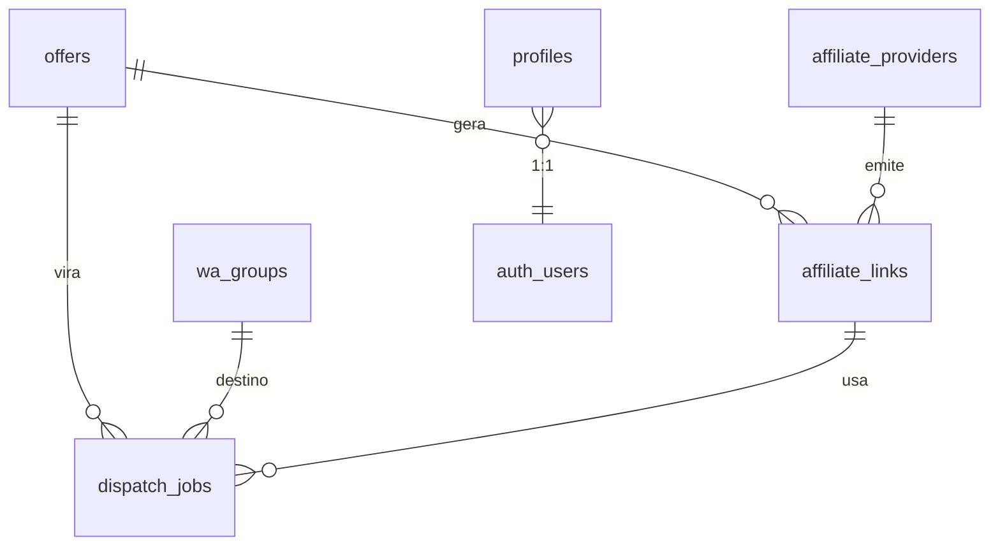

# System Design — Grupo de Venda

**Estado:** as-built em 2026-08-02 (`main` @ `3178317`)
**Público:** engenheiro entrando no projeto ou revisando a arquitetura.

---

## 1. O que o sistema faz

Automatiza a operação de um grupo de ofertas no WhatsApp, de ponta a ponta:

1. **Colhe** ofertas de marketplaces (Mercado Livre, Amazon, Shopee) via Firecrawl.
2. **Enriquece**: gera legenda de venda com IA e emite link de afiliado.
3. **Revisa**: espelha as ofertas numa planilha Google onde um humano aprova/edita.
4. **Dispara** as aprovadas nos grupos de WhatsApp, respeitando limites anti-ban.
5. **Observa** tudo num dashboard single-tenant protegido por login.

Operação é single-tenant (um admin), com uma única sessão de WhatsApp por deploy.

---

## 2. Visão geral (topologia)



**Por que dois runtimes.** Baileys mantém um socket WebSocket persistente com o
WhatsApp e credenciais Signal em memória — incompatível com funções serverless,
que morrem entre requisições. O worker fica no Render (processo vivo), e a app
fala com ele por HTTP autenticado. Todo o resto (UI, APIs, orquestração, crons)
roda na Vercel.

---

## 3. Fluxo de dados principal



O ciclo de vida de uma oferta:



E o da legenda, em paralelo: `none → pending` (exportada p/ planilha) `→ ready`
(gerada pela IA ou escrita à mão) `→ failed` (erro no LLM, reprocessa no próximo run).

---

## 4. Componentes

### 4.1 App Next.js (`src/`) — Vercel

Next.js 16 (App Router), React 19, Tailwind 4. Sem ORM: acesso ao Postgres via
`@supabase/supabase-js`.

| Camada | Onde | Papel |
|---|---|---|
| UI | `src/app/(dashboard)/`, `src/components/` | Dashboard, ofertas, grupos, links, disparos, bot |
| APIs | `src/app/api/**/route.ts` | 26 route handlers (tabela na §5) |
| Domínio | `src/lib/` | Scrapers, pipeline, dispatch, afiliados, sheets, IA |
| Auth | `src/middleware.ts`, `src/lib/supabase/` | Sessão Supabase em cookie; redirect p/ `/login` |

Três clientes Supabase distintos, por intenção:
`client.ts` (browser, anon) · `server.ts` (RSC/rotas, sessão do usuário, RLS ativa) ·
`service.ts` (service role, bypass de RLS — só em cron/pipeline).

### 4.2 Worker Baileys (`worker/`) — Render

Package Node **separado** (`npm ci` próprio, `tsx`, sem framework HTTP — `node:http` puro).
Blueprint em `render.yaml`, `rootDir: worker`, `autoDeploy: true`.

| Rota | Uso |
|---|---|
| `GET /health` | Healthcheck do Render (única rota sem segredo) |
| `GET /session` | Status runtime (`connected`, `qr`, `waiting_pairing`, …) |
| `GET /session/qr`, `/session/pairing-code` | Pareamento pelo dashboard |
| `POST /session/pair`, `/session/start`, `/session/logout` | Ciclo de vida da sessão |
| `GET /groups` | Lista grupos participantes (import p/ `wa_groups`) |
| `POST /send` | Envia mensagem; dedup em memória por `jobId` |

Todas as rotas (menos `/health`) exigem header `x-worker-secret`.

**Persistência da sessão WhatsApp.** As credenciais Signal ficam em
`wa_session_keys`, cifradas com AES-256-GCM (`WHATSAPP_SESSION_KEY`, 32 bytes base64).
Sem essa chave o worker cai no modo multi-file em disco — e disco no Render é
efêmero, então a sessão morre a cada deploy.

> **Invariante crítico:** falha ao carregar/decodificar a sessão **lança**, nunca
> chama `initAuthCreds()` como fallback. O `saveCreds` seguinte sobrescreveria a
> sessão pareada (sintoma clássico: "a conta some depois do deploy"). Só se inicializa
> do zero quando a linha `creds` realmente não existe. O gate de "está pareado" é
> `creds.account`, não `me`.

### 4.3 Scrapers (`src/lib/scrapers/`)

```
registry → scraper por fonte → firecrawl.scrapeOffersFromUrl (formats: links+html)
        → html-extract.harvestOffers (só hrefs presentes na página)
        → product-filter.isProductOffer (descarta menu/banner/login)
        → url-alive.filterAliveOffers (GET, não HEAD)
        → normalize.canonicalizeUrl → dedupe → supabase-store.upsertOffer
```

Decisões que valem explicar numa apresentação (todas medidas, não supostas):

- **Sem `extract` por LLM.** A versão antiga usava extração por LLM e alucinou 42
  URLs `/dp/ASIN` inexistentes — 42/42 mortas na verificação. Hoje só se grava
  href que estava literalmente na página.
- **Vivacidade pelo GET.** A Amazon responde **503 a todo HEAD**, ASIN válido ou
  não. `401/403/429` são keep (falam do bot, não do recurso); `404/410` são drop.
- **ML e Shopee são SPA**: devolvem 200 para qualquer path — validação HTTP ali é
  cega, e a garantia vem só de colher href presente na página.
- **Colheita vazia é falha.** Fonte ativa que colhe 0 marca o run `ok=false` com
  motivo legível; sucesso vazio silencioso escondia quebras de layout.
- **Shopee** exige `FIRECRAWL_SHOPEE_PROFILE` (profile de browser logado, com
  `saveChanges:false`). Login por env nunca autenticou nada lá. O paywall vem
  como HTTP 200 com "Login Necessário" no HTML → vira exceção explícita.
- `SCRAPE_MOCK=1` desliga toda chamada externa (CI e dev local sem gastar crédito).

### 4.4 Pipeline (`src/lib/pipeline/run.ts`)

Cinco etapas sequenciais, idempotentes, em lotes pequenos (10 ofertas; 3 legendas):

| # | Etapa | Efeito |
|---|---|---|
| 1 | `exportToSheets` | Ofertas sem `sheets_row` → append na planilha; grava `sheets_row` |
| 2 | `generateCaptions` | `caption_status pending\|none` → 9router → `ready` + write-back |
| 3 | `importFromSheets` | Lê a planilha e aplica edições humanas de `status`/`caption` |
| 4 | `ensureAffiliates` | Emite link de afiliado p/ oferta `ready` sem link `ok` |
| 5 | `autoEnqueue` | Se `auto_dispatch_enabled`, cria `dispatch_jobs` nos grupos configurados |

**DB é canônico; a planilha é espelho + interface de revisão.** Daí duas regras
anti-regressão no import: não rebaixa oferta já `sent` (o status na planilha fica
stale) e não sobrescreve `caption` recém-gerada (`caption_status=ready` vence).

Erros nunca abortam o run — vão para `result.errors[]` e aparecem no painel.
Se o Sheets não estiver configurado, as etapas 1 e 3 são simplesmente puladas
(degradação graciosa: o pipeline continua gerando legenda, afiliado e fila).

### 4.5 Afiliados (`src/lib/affiliates/`)

Registry com 4 `kind`: `generic`, `livelo`, `meliuz`, `mercadolivre`.
Os três primeiros são template de URL (`{{url}}` + query params). O de Mercado
Livre chama o portal real:

1. `GET` na página do linkbuilder com a sessão → `_csrf` fresco no `Set-Cookie` +
   `<meta name="csrf-token">` no HTML.
2. `POST createLink` com cookie (sessão + `_csrf`) e header `x-csrf-token`.
   Sem isso o ML responde 403 `EBADCSRFTOKEN`. Resposta: `urls[0].short_url` (`meli.la/XXXX`).

Degradação graciosa em três situações — sem `ML_AFFILIATE_COOKIE`, sem tag, ou
URL fora do domínio ML (o `createLink` rejeita com `URL Invalid`): cai no link
longo com `matt_word`/`matt_tool`, que mantém o cashback, só não encurta.
Por isso o pipeline **roteia o provider por `source`**: `mercadolivre` → provider ML,
demais → `generic-tag`.

### 4.6 Disparo (`src/lib/dispatch/`)

`enqueue.ts` valida e cria os jobs; `process.ts` consome a fila.

Gates de enfileiramento — todos obrigatórios:

- sessão WhatsApp `connected` (consultada no worker em tempo real);
- grupo existe e `active`;
- oferta tem `affiliate_links` com `status='ok'`;
- não existe job `queued|sending|sent` para o mesmo par oferta+grupo no dia UTC.

Gates de envio (`rate-limit.ts`), configuráveis em `app_settings`:
teto diário (35), teto horário (10), intervalo mínimo (45s) e **janela de descanso**
em horário de São Paulo (`sleep_start`/`sleep_end`, suporta cruzar a meia-noite).

Concorrência: dois crons podem sobrepor, então o job é reivindicado por
**update condicional** (`set status='sending' where id=? and status='queued'`) —
quem não recebe linha de volta desiste. Como reforço no banco há um índice único
parcial `(offer_id, group_id, date(sent_at)) where status='sent'`, e o worker
deduplica por `jobId` em memória.

---

## 5. Superfície HTTP (app)

Todas as rotas `/api/*` exigem sessão Supabase (`requireUser`), exceto as de cron,
que exigem `CRON_SECRET` (`Authorization: Bearer` ou `x-cron-secret`).

| Rota | Métodos | Função |
|---|---|---|
| `/api/stats/overview` | GET | KPIs do dia (enviados, fila, falhas, caps, status da sessão) |
| `/api/offers`, `/api/offers/[id]` | GET, POST, PATCH | CRUD/aprovação de ofertas |
| `/api/groups`, `/api/groups/[id]` | GET, POST, PATCH, DELETE | Grupos WhatsApp |
| `/api/affiliate-providers`, `/api/affiliate-links` | GET, POST | Providers e emissão de links |
| `/api/dispatch`, `/api/dispatch/[id]`, `/api/dispatch/run` | GET, POST | Fila de disparo e execução manual |
| `/api/settings` | GET, PATCH | Caps, template, janela de descanso, auto-dispatch |
| `/api/scrape/run`, `/api/scrape/sessions` | POST, GET | Scrape manual; status de sessão por marketplace |
| `/api/pipeline/run`, `/api/pipeline/status` | POST, GET | Pipeline manual e último resultado |
| `/api/bot/status\|qr\|pairing-code\|pair\|reconnect\|logout\|test-send` | GET/POST | Proxy autenticado para o worker |
| `/api/cron/scrape` | GET | 11h, 16h, 21h |
| `/api/cron/pipeline` | GET, POST | :15 de 11h, 16h, 21h (`maxDuration` 300s) |
| `/api/cron/dispatch` | GET, POST | a cada 5 min |
| `/api/cron/keepalive` | GET, POST | a cada 5 min — mantém o 9router acordado no free tier do Render |

---

## 6. Modelo de dados (Postgres/Supabase)



| Tabela | Papel | Colunas de destaque |
|---|---|---|
| `profiles` | Admin 1:1 com `auth.users` | trigger `handle_new_user` |
| `offers` | Catálogo de ofertas | `status`, `caption`, `caption_status`, `sheets_row`, `price_cents`, `original_price_cents`, único `(source, url_canonical)` |
| `scrape_runs` | Auditoria de cada colheita | `ok`, `items_found`, `items_upserted`, `error` |
| `affiliate_providers` | Providers | `kind` (`generic\|livelo\|meliuz\|mercadolivre`), `config` jsonb |
| `affiliate_links` | Links emitidos | `status ok\|failed`, `error` |
| `wa_groups` | Grupos alvo | `jid` único, `active`, `daily_limit` |
| `wa_session` | Estado persistido da sessão WA | `status`, `pairing_code`, `phone` |
| `wa_session_keys` | Credenciais Baileys **cifradas** | sem policy p/ `authenticated` — só service role |
| `marketplace_sessions` | Cookies de login por marketplace | `status ok\|expired\|error\|unknown` |
| `app_settings` | Linha única (`id=1`) | caps, `message_template`, `sleep_start/end`, `auto_dispatch_*` |
| `dispatch_jobs` | Fila de envio | `status`, `message_body`, `scheduled_for`, índice único 1 envio/dia por par |

RLS ligada em todas. Padrão: `authenticated` tem acesso total (single-tenant);
`wa_session_keys` é a exceção deliberada — nenhuma policy, só service role alcança.

---

## 7. Segurança

| Fronteira | Mecanismo |
|---|---|
| Browser → App | Sessão Supabase em cookie, renovada no `middleware.ts`; `/dashboard` redireciona p/ `/login` |
| Cron → App | `CRON_SECRET` (Bearer ou `x-cron-secret`) |
| App → Worker | `x-worker-secret` (`WORKER_API_SECRET` idêntico dos dois lados) |
| Worker → Postgres | Service role via PostgREST |
| Credenciais WA | AES-256-GCM com `WHATSAPP_SESSION_KEY`, em repouso no banco |

Segredos (`FIRECRAWL_API_KEY`, `ML_AFFILIATE_COOKIE`, chaves Google, service role)
existem **apenas** em env server-side — nunca em `NEXT_PUBLIC_*`, nunca no bundle,
nunca no git.

> **Armadilha de CI documentada.** Os placeholders `NEXT_PUBLIC_SUPABASE_*=https://ci.supabase.co`
> ficam só nos jobs `quality`/`build`. Se vazarem para o job `deploy`, o shell os
> passa ao `vercel build` e `ci.supabase.co` é **embutido no bundle** — o login de
> produção quebra. Há um `grep` de guarda no output antes do deploy.

---

## 8. Deploy e CI

Dois caminhos independentes, que não se misturam:

| Alvo | Como |
|---|---|
| **App (Vercel)** | Auto-deploy do Git **desligado** (`vercel.json`). O job `Deploy Vercel (Produção)` do CI faz `vercel pull` → `vercel build --prod` → guard anti-placeholder → `vercel deploy --prebuilt --prod`, só em push na `main`. |
| **Worker (Render)** | Blueprint `render.yaml`, `autoDeploy: true`. Push que não toca `worker/` não redeploya (por causa do `rootDir`). |

Pipeline de CI: `lint` → `typecheck` (app + worker) → `test` (Vitest, 29 arquivos)
→ `build` smoke → `npm audit --audit-level=critical` → deploy (só `main`).
Há ainda um smoke de produção agendado que valida `/login` e a proteção do `/dashboard`.

O `tsconfig` da app **exclui** `worker/` e `tests/` — o worker tem typecheck próprio
(`npm run worker:typecheck`).

---

## 9. Trade-offs assumidos

| Decisão | Por quê | Custo aceito |
|---|---|---|
| Sem ORM | Poucas tabelas, queries diretas | Sem tipos gerados do schema |
| Fila no Postgres, não em broker | Volume baixo (~35 msgs/dia); zero infra extra | Polling de 5 min; claim otimista em vez de lock |
| Planilha como UI de revisão | Aprovar oferta no celular sem app dedicado | Sincronização bidirecional exige regras anti-regressão |
| Sessão WA única | Modelo de negócio é um número só | Reparear é intervenção manual pelo dashboard |
| Scrape por href, sem LLM | LLM alucinava URLs (medido) | Quebra quando o marketplace muda o layout — por isso "colheita vazia = falha" |
| Render free tier | Custo zero | Serviço dorme; daí o cron de keepalive |

---

## 10. Riscos conhecidos

1. **Bloqueio do WhatsApp** — mitigado por caps, intervalo mínimo e janela de
   descanso, mas nunca eliminado. Uma sessão banida exige novo pareamento.
2. **Cookie do portal ML expira** — degrada para link longo (não quebra), mas o
   link curto some até alguém renovar `ML_AFFILIATE_COOKIE`.
3. **Mudança de layout dos marketplaces** — vira run `ok=false` visível no painel,
   não silêncio; ainda assim é intervenção manual.
4. **Free tier do Render** — cold start pode atrasar um ciclo de disparo.
5. **Sem retry automático de job `failed`** — hoje falha fica registrada e espera
   ação humana.

---

## 11. Como rodar

```bash
npm install && npm ci --prefix worker

npm run dev                 # app  :3000
npm run worker:dev          # worker :3100 (precisa de worker/.env)

npm run lint
npm run typecheck           # só a app
npm run worker:typecheck
npm run test                # vitest
npm run build
```

`SCRAPE_MOCK=1` dá o ciclo completo sem tocar em Firecrawl, 9router ou Sheets.
Variáveis: `.env.example` (app) e o bloco `worker/.env` no fim do mesmo arquivo.

Referências: `STATE.md` (invariantes por feature entregue) e `docs/specs/` (specs SDD).
